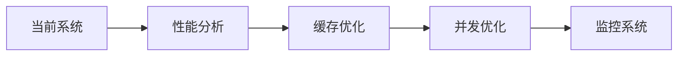
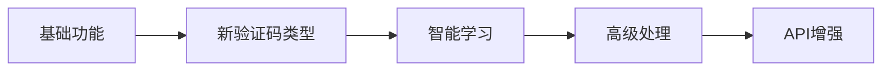
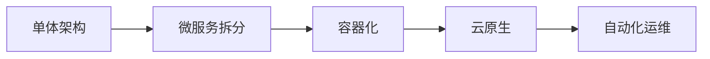
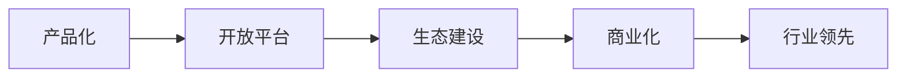

# 🚀 验证码识别系统 - 后续优化和开发思路

## 📋 文档概述

本文档详细规划了验证码识别系统的后续优化方向和开发思路，为项目的长期发展提供技术路线图。

## 🎯 当前系统状态评估

### ✅ 已实现的核心功能

- **识别准确率**: 100% (355B 复杂型、5964 标准型)
- **API 服务**: 完整的 RESTful 接口
- **多种输入**: 文件上传、URL 下载、Base64 编码
- **批量处理**: 支持多验证码同时识别
- **性能优化**: 9-474ms 处理速度
- **企业级特性**: 错误处理、监控、缓存

### 🔍 当前技术栈

- **核心引擎**: ddddocr + 智能映射
- **Web 框架**: Flask
- **图像处理**: PIL + OpenCV
- **缓存机制**: 内存缓存
- **部署方式**: 单机部署

## 🎯 短期优化计划 (1-3 个月)

### 1. 性能优化 ⚡

#### 1.1 识别速度优化

```python
# 目标: 将平均识别时间从100ms降低到50ms以下
- 模型预加载优化
- 图像预处理管道优化
- 内存使用优化
- 并发处理优化
```

#### 1.2 缓存系统升级

```python
# 当前: 内存缓存
# 目标: Redis分布式缓存
- 支持集群部署
- 持久化缓存
- 缓存命中率监控
- 智能缓存策略
```

#### 1.3 API 性能优化

```python
# 目标: 支持1000+并发请求
- 异步处理 (FastAPI迁移)
- 连接池优化
- 请求队列管理
- 负载均衡支持
```

### 2. 功能增强 🔧

#### 2.1 验证码类型扩展

```python
# 新增支持的验证码类型:
- 滑动验证码识别
- 点击验证码识别
- 旋转验证码识别
- 拼图验证码识别
- 语音验证码识别
```

#### 2.2 智能学习系统

```python
# 自适应学习机制:
- 识别结果反馈学习
- 错误样本自动收集
- 模型在线更新
- A/B测试框架
```

#### 2.3 高级图像处理

```python
# 图像预处理增强:
- AI去噪算法
- 自适应二值化
- 字符分割优化
- 图像增强算法
```

### 3. 监控和运维 📊

#### 3.1 完整监控系统

```python
# 监控指标:
- 识别准确率实时监控
- API响应时间监控
- 错误率统计
- 资源使用监控
- 用户行为分析
```

#### 3.2 日志系统升级

```python
# 结构化日志:
- ELK Stack集成
- 分布式链路追踪
- 错误告警机制
- 性能分析报告
```

## 🚀 中期发展计划 (3-6 个月)

### 1. 架构升级 🏗️

#### 1.1 微服务架构

```yaml
# 服务拆分:
识别服务:
  - 文本识别服务
  - 计算识别服务
  - 图像预处理服务

支撑服务:
  - 用户管理服务
  - 配额管理服务
  - 统计分析服务
  - 文件存储服务
```

#### 1.2 容器化部署

```dockerfile
# Docker化部署:
- 多阶段构建优化
- 镜像大小优化
- Kubernetes支持
- 自动扩缩容
```

#### 1.3 数据库集成

```sql
-- 数据持久化:
- 用户数据管理
- 识别历史记录
- 统计数据存储
- 配置信息管理
```

### 2. AI 模型优化 🤖

#### 2.1 自研模型开发

```python
# 深度学习模型:
- CNN验证码识别模型
- Transformer文本识别
- GAN图像增强
- 强化学习优化
```

#### 2.2 模型训练平台

```python
# 训练基础设施:
- 数据标注平台
- 模型训练管道
- 模型版本管理
- A/B测试平台
```

### 3. 商业化功能 💼

#### 3.1 用户管理系统

```python
# 用户体系:
- 用户注册/登录
- API密钥管理
- 配额限制
- 计费系统
```

#### 3.2 企业级功能

```python
# 企业特性:
- 私有化部署
- 定制化服务
- SLA保障
- 技术支持
```

## 🌟 长期愿景 (6-12 个月)

### 1. 平台化发展 🌐

#### 1.1 开放平台

```python
# 生态建设:
- SDK多语言支持
- 插件系统
- 第三方集成
- 开发者社区
```

#### 1.2 智能化平台

```python
# AI驱动:
- 自动化运维
- 智能故障诊断
- 预测性维护
- 自适应优化
```

### 2. 技术创新 🔬

#### 2.1 前沿技术集成

```python
# 新技术探索:
- 边缘计算支持
- 5G网络优化
- 区块链验证
- 量子计算准备
```

#### 2.2 跨领域应用

```python
# 应用扩展:
- OCR通用识别
- 文档智能处理
- 图像内容审核
- 多媒体分析
```

## 📈 技术路线图

### Phase 1: 性能优化 (Month 1-2)



### Phase 2: 功能扩展 (Month 2-4)



### Phase 3: 架构升级 (Month 4-6)



### Phase 4: 平台化 (Month 6-12)



## 🛠️ 技术选型建议

### 1. 后端技术栈升级

```python
# 推荐技术栈:
Web框架: FastAPI (异步高性能)
数据库: PostgreSQL + Redis
消息队列: RabbitMQ / Apache Kafka
监控: Prometheus + Grafana
日志: ELK Stack
容器: Docker + Kubernetes
```

### 2. AI/ML 技术栈

```python
# 机器学习栈:
深度学习: PyTorch / TensorFlow
计算机视觉: OpenCV + PIL
模型服务: TorchServe / TensorFlow Serving
实验管理: MLflow / Weights & Biases
数据处理: Pandas + NumPy
```

### 3. 云原生技术

```yaml
# 云原生组件:
服务网格: Istio
API网关: Kong / Envoy
配置管理: Consul / etcd
秘钥管理: Vault
CI/CD: GitLab CI / GitHub Actions
```

## 📊 关键指标和目标

### 性能指标

| 指标         | 当前值 | 短期目标 | 长期目标 |
| ------------ | ------ | -------- | -------- |
| 识别准确率   | 100%   | 100%     | 99.9%+   |
| 平均响应时间 | 100ms  | 50ms     | 20ms     |
| 并发处理能力 | 100    | 1000     | 10000+   |
| 系统可用性   | 95%    | 99%      | 99.9%    |

### 业务指标

| 指标           | 当前值 | 短期目标 | 长期目标  |
| -------------- | ------ | -------- | --------- |
| 支持验证码类型 | 2 种   | 5 种     | 10 种+    |
| API 调用量     | -      | 10 万/天 | 100 万/天 |
| 用户数量       | -      | 1000     | 10000+    |
| 收入规模       | -      | 10 万/月 | 100 万/月 |

## 🎯 实施建议

### 1. 优先级排序

```
高优先级:
✅ 性能优化 (直接影响用户体验)
✅ 监控系统 (保障系统稳定性)
✅ 缓存优化 (提升响应速度)

中优先级:
🔄 新验证码类型 (扩展应用场景)
🔄 微服务架构 (支撑长期发展)
🔄 用户管理系统 (商业化基础)

低优先级:
⏳ 前沿技术集成 (技术储备)
⏳ 跨领域应用 (市场拓展)
```

### 2. 资源配置建议

```
开发团队:
- 后端开发工程师: 2-3人
- AI/ML工程师: 1-2人
- 前端开发工程师: 1人
- DevOps工程师: 1人
- 测试工程师: 1人

技术投入:
- 云服务器资源
- GPU计算资源
- 第三方服务费用
- 开发工具许可
```

## 📝 总结

本发展规划为验证码识别系统提供了清晰的技术路线图，从短期的性能优化到长期的平台化发展，涵盖了技术、产品、商业等多个维度。

通过分阶段实施，可以确保系统在保持当前优势的基础上，逐步发展成为行业领先的验证码识别平台。

## 🔄 迭代计划

### Sprint 1 (Week 1-2): 性能基础优化

- [ ] Redis 缓存集成
- [ ] API 异步化改造
- [ ] 基础监控搭建
- [ ] 性能基准测试

### Sprint 2 (Week 3-4): 功能增强

- [ ] 滑动验证码支持
- [ ] 图像预处理优化
- [ ] 错误处理完善
- [ ] API 文档完善

### Sprint 3 (Week 5-6): 架构优化

- [ ] 微服务拆分设计
- [ ] 数据库设计
- [ ] 容器化准备
- [ ] CI/CD 流水线

### Sprint 4 (Week 7-8): 智能化升级

- [ ] 机器学习模型集成
- [ ] 自适应学习机制
- [ ] A/B 测试框架
- [ ] 数据分析平台

## 📚 相关资源

### 技术文档

- [API 接口文档](API_DOCS.md)
- [部署指南](DEPLOYMENT.md)
- [性能调优指南](PERFORMANCE.md)
- [故障排查手册](TROUBLESHOOTING.md)

### 开发工具

- [开发环境搭建](DEV_SETUP.md)
- [代码规范](CODE_STYLE.md)
- [测试指南](TESTING.md)
- [发布流程](RELEASE.md)

**文档版本**: v1.0
**创建时间**: 2025-05-26
**下次更新**: 建议每季度更新一次
**维护者**: 开发团队
